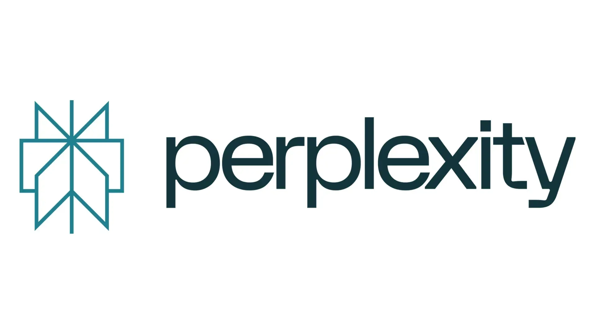
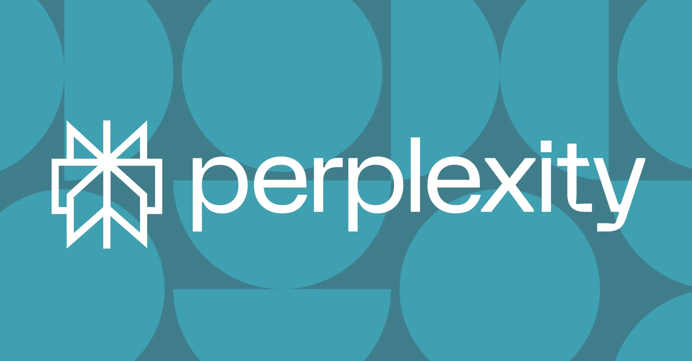
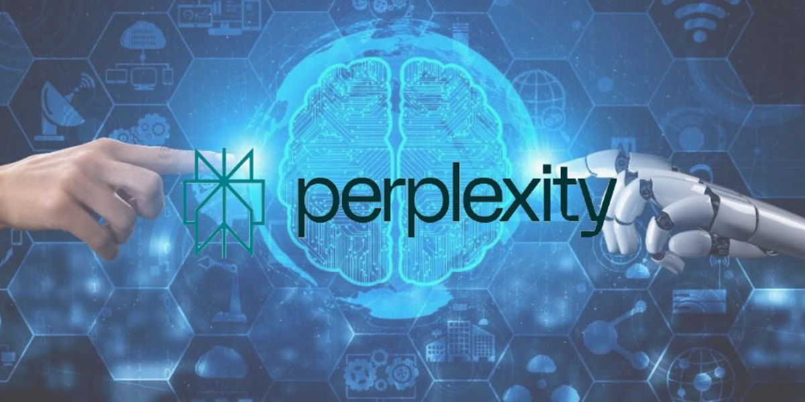
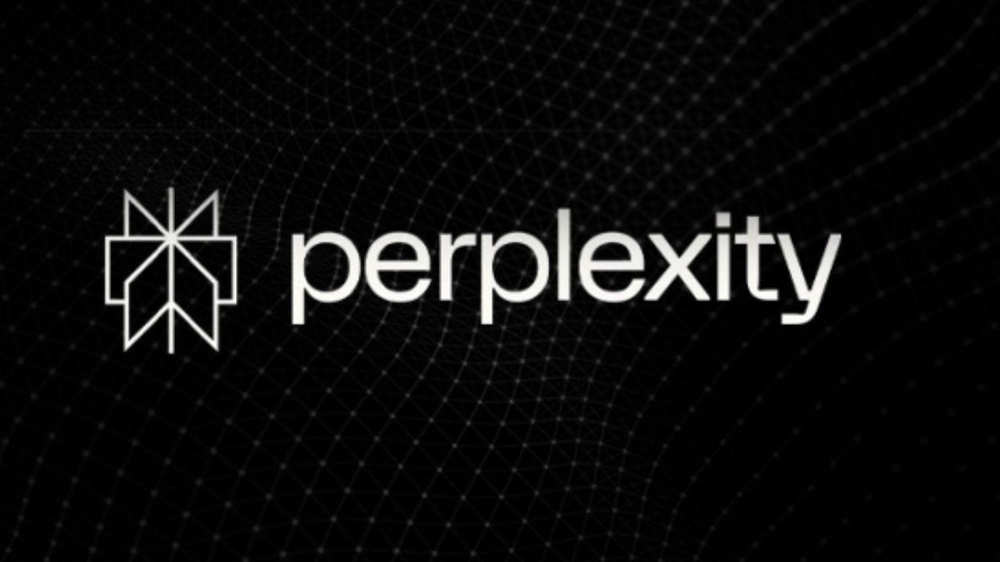

# 一个会聊天的搜索引擎：Perplexity 到底是什么？

---

你有没有遇到过这种情况：在 Google 上搜索一个问题，结果打开了十几个标签页，每个网站都说得不一样，最后你还是不知道该信谁。

Perplexity 就是为了解决这个问题而生的。它不会甩给你一堆链接让你自己慢慢翻，而是直接给你一个清楚的答案，并且告诉你这些信息是从哪儿来的。你可以像跟朋友聊天一样提问，它会理解你的意思，然后把网上的相关信息整理好呈现给你。最重要的是，它会标注信息来源——这意味着你可以随时去原网站核实，而不是盲目相信一个 AI 的一面之词。

如果你经常需要快速找到靠谱信息，又不想在一堆搜索结果里迷路，👉 [试试这个能直接给答案的搜索工具](https://pplx.ai/ixkwood69619635)，可能会让你的工作效率翻倍。

---

## Perplexity 是什么东西

简单说，Perplexity 是一个"会思考"的搜索引擎。

它不像传统搜索引擎那样只给你一堆链接，而是会理解你的问题，去网上找资料，然后用人话把答案总结出来，并在底部列出参考来源。你不需要再从一个网页跳到另一个网页，它已经帮你做完了这个过程。

和 Google 或 Bing 最大的区别在于：你不需要琢磨关键词怎么写。你就像平时说话一样提问就行，比如"最近哪个国家的通货膨胀最严重？"或者"怎么在家做出好吃的披萨？"它能理解你真正想问什么，而不是机械地匹配关键词。

它的核心是一套语言模型，能够理解人类语言的细微差别，再加上实时搜索功能，可以抓取最新的网络信息。这样一来，即使是复杂的问题，它也能给出比较精准的回答。

最让人放心的是，它不会藏着掖着信息来源。每个答案下面都有几个突出显示的链接，你可以点开查看原文。如果你想看完整的参考列表，还有一个按钮可以展开所有来源。这种透明度让你可以快速验证信息的可靠性，就像做学术研究一样。

界面也很直接。打开网站，输入问题，就这么简单。简单的查询不需要注册账号，但如果你想保存历史记录或使用一些高级功能，注册一个账号会更方便。

## 它是怎么工作的

主页看起来像一个带聊天功能的搜索引擎。你有一个文本输入框，下面有一些建议的问题，还有"焦点"选项可以缩小搜索范围。系统会把自然语言处理和网络爬虫结合起来，选择相关内容，然后生成一个简短的、带引用的答案。

整个流程很简单：你提问，Perplexity 分析你的意图，实时搜索网络，比较不同来源，总结关键信息，然后把答案和链接一起呈现给你。如果是很直接的问题，比如天气预报，它还会加上图片或图表。

**焦点模式**可以提高准确性。你可以让它优先搜索普通网页、学术文档、社交媒体，甚至视频。它还有专门的写作辅助和数学问题帮助模式，甚至集成了类似 Wolfram Alpha 的科学计算功能。

在回答中，你会看到一个来源区域，通常显示三个最常访问的网站，还有一个链接可以展开完整列表。侧边栏还可以显示与查询相关的图片或视频。

**文件上传**功能扩展了它的用途。你可以上传 PDF 或 CSV 文件，让它帮你搜索和分析内容。这对于总结长篇报告、查找特定数据或交叉引用信息非常有用，省去了复制粘贴的麻烦。

## 和 Google、ChatGPT 有什么不同

和 Google 相比，最大的区别在于界面和目的。Google 会根据排名算法列出一堆结果，而 Perplexity 会尝试理解你的问题，搜索信息，整合内容，然后写出一个连贯的答案并附上参考文献。就像有人帮你做了一个快速的研究项目：阅读、理解、解释，最后附上参考书目。

和 ChatGPT 相比，Perplexity 默认依赖网络，并且会直接显示信息来源。ChatGPT 的准确性取决于它的训练数据和时间截止点，而 Perplexity 可以在需要时检索最新的信息，这在处理时事问题时尤其明显。

关于可靠性，有一点很重要：AI 和搜索引擎都会犯错。Perplexity 通过提供可见的引用来降低这种风险，但最好还是打开链接自己核实一下。如果只有一个来源，或者信息看起来不够充分，就需要格外小心。支持某个观点的可靠参考文献越多越好。

另一个优点是没有广告和干扰。很多人强调 Perplexity 提供的是一个以内容为中心的体验，没有广告打扰。这减少了干扰，也减少了回答过程中潜在的商业偏见。

个性化和上下文理解也很重要。系统可以根据你的需求调整结果，并在同一主题的连续问题之间保持一致的流程，确保一系列问题能得到连贯的解答。

## 主要功能和模式

**搜索模式**有几种。副驾驶模式会提出一些澄清性问题来完善你的意图；焦点模式可以明确查询范围，比如优先考虑 YouTube 视频；写作模式则可以在不上网的情况下生成写作建议。这些模式帮助你理清思路，引导你找到需要的答案。

**来源显示**很直接。每个答案上方都会显示几个主要链接，还有一个选项可以展开所有参考文献。这明确地鼓励你去核实和扩展阅读，这在做研究或做决定时非常重要。

**文件上传和内部搜索**功能让你可以上传 PDF 和其他格式（比如 CSV）进行直接分析。这个功能可以帮你轻松完成诸如总结长篇报告或查找特定数字等任务，而不需要阅读几十页的资料。

**高级帮助集成**方面，对于科学计算或数据处理，它依赖类似 Wolfram Alpha 的功能。它还有一个逐步搜索模式，用于解决复杂任务，并指导整个过程。

**支持和应用程序**方面，它有适用于 iOS 和 Android 的应用程序，基本使用不需要账号。注册后，你可以将对话保存到库中并激活付费功能。

## 实际用途和真实例子

**时事总结**：如果你想了解某个科技公司最近的人事变动，或者在突发新闻后询问公司负责人的情况，Perplexity 可以收集最新信息，引用可靠来源，避免你在一堆链接里迷路。如果话题很新，记得检查来源的日期。

**体育统计**：只要有开放的数据库，你就能回答诸如"谁在某个联赛中头球进球最多"这样的问题。如果只找到一个网站汇编这些数据,那么答案就只能局限于这个单一的参考资料，而且可能过时。

**浮动利率和价格**：对于诸如"明天的电价是多少"或"某个技术服务的官方费率"这类问题，系统通常会解释在哪里可以查找，并在数据可用时显示出来。如果你提问时数据还没发布，系统会告诉你数据发布后去哪里获取。

**随时间变化的法规**：Perplexity 可以举例说明 V-16 应急灯或法规变更等要求，并提供官方公告或网站的链接。即便如此，阅读细则并与原文比较仍然是个好主意。

**市场营销和商业**：在中小企业和小团队中，它的价值在于减少研究时间。它可以综合趋势，比较竞争对手，提出内容营销的想法，并帮助利用数据优化营销活动。引用链接有助于实现专业环境中所需的可追溯性。

## 对企业和营销的好处

**无广告或干扰**：清晰的体验让你专注于信息。在商业决策中，时间就是金钱，避免干扰可以简化研究过程。

**引用可靠来源**：直接链接到研究、文章和数据库提供了透明度，并促进了行动前的验证，这对于营销、财务和法律事务至关重要。

**个性化能力**：Perplexity 会根据你的查询内容调整响应，为你的行业、市场或地理区域提供更相关的结果。

**高影响力用例**：快速的市场研究、内容创意生成、客户支持和活动优化都是它在速度和清晰度方面表现优异的领域。

**横向应用**：除了营销，它对于项目管理、财务和人力资源来说，以几乎零学习曲线的方式提供有关最佳实践、工具和新技术的咨询也很有用。

## Perplexity 免费版 vs Pro 版

付费版本 Perplexity Pro 增加了高级功能，需要每月支付一定费用。它强调了选择组成响应的 AI 模型的可能性，包括一些众所周知的选项，比如 GPT-4o，这让你可以根据任务优先考虑质量、速度或成本。

**每日专业咨询，质量更好**：该计划允许使用更强大的模型进行大量查询，这些模型通常提供更强大的措辞或对复杂主题的更好理解。

**文件和图像**：在专业版中，文件分析更加自由，并且根据公开文档，某些功能甚至支持使用不同模型生成或呈现图像。Perplexity 过去专注于文本响应,但最近的产品加入了有限的多模式功能。

**模型灵活性**：通过不依赖单个引擎的进度，你可以为每种情况选择最合适的引擎，这在有严格的期限或质量要求时很有用。

## 怎么一步步使用 Perplexity

**从浏览器访问或安装应用程序**：在 iOS 或 Android 上都可以使用。移动体验和桌面体验很相似，所以你可以在不同设备之间无缝切换。

**用自然语言写下你的问题**：越具体越好。加上背景信息，比如日期、地点或你感兴趣的格式。例如，"根据联合国最近的报告，气候变化的主要原因是什么？"比简单地问"气候变化"要好得多。

**提交并查看来源**：几秒钟后，你就能看到答案和支持链接。打开你感兴趣的链接，验证、扩展或保存有用的参考资料。

**通过追问来细化**：继续对话以寻求更简单的解释，获得相反的观点，或深入探讨子主题，同时保持话题的上下文。

**如果需要更多功能，创建账号**：登录后可以查看历史记录、组织对话线程，并访问具有高级模板和响应优先级的专业模式。

## 准确性和验证技巧

**寻找可信域名**：比如政府网站、教育网站或知名媒体。对于时事查询，优先考虑近期文章。并且更重视有多个独立来源支持的答案。

**检查参考文献的日期和偏见**：过时的来源可能导致错误。如果某些内容对你的工作或学习至关重要，打开链接仔细检查关键信息。

**记住限制**：AI 可能会过度简化或误解模棱两可的问题。重新表述通常可以极大地改善答案和所选来源。

**隐私和数据**：避免输入敏感信息。如果你处理的是内部或机密资料，仔细阅读使用和隐私政策，并谨慎使用归档方法。

**如有疑问,手动检查**：Perplexity 的价值在于节省时间，而不是取代批判性思维。只需点击几下验证，就能带来巨大的改变。

## 历史、团队和融资

Perplexity 成立于 2022 年，创始人是 Aravind Srinivas、Denis Yarats、Johnny Ho 和 Andy Konwinski。Srinivas 曾是 OpenAI 的研究员，现在担任首席执行官。公司致力于将对话和搜索与信息来源透明化相结合。

**产品和里程碑**：2022 年底，他们发布了 Bird SQL，用于在 Twitter 上搜索信息。他们的主要产品是一款对话式搜索引擎，可以解析上下文，优先显示最近的来源，并允许你将对话保存到库中。官方应用程序适用于 iOS 和 Android 系统。

**Perplexity 助手**：2025 年初，他们宣布了一款 Android 内置助手，可以跨多个应用执行任务，在操作之间保持上下文关联，并使用手机摄像头响应环境或屏幕内容的反馈。他们宣布，该助手将免费提供多种语言版本，包括西班牙语，但部分功能需要额外配置，且产品仍在不断完善中。

**融资和数据**：公司在 B 轮融资中筹集了约 7360 万美元，据报道估值约为 10 亿美元。投资者包括 NEA、Bessemer 等公司，以及 Nvidia、杰夫·贝佐斯、Susan Wojcicki、Jeff Dean、Yann LeCun 和 Andrej Karpathy 等知名人士。尽管融资规模巨大，但公司的员工队伍非常精简，据报道每月用户数量已达数百万。

## 争议与挑战

**关于内容使用和 robots.txt 的争论**：2024 年，研究表明 Perplexity 并非始终遵守 robots.txt 标准，并且能够从元数据或代码片段等间接痕迹中提取内容。公司回应称，他们同时使用自有和第三方爬虫程序，并正在努力完善细节。

**与媒体的冲突**：《福布斯》等媒体公开批评其内容归属问题，并于 2024 年收到多家出版集团的通知和诉讼，指控其侵权。Perplexity 为其信息收集和引用行为进行了辩护，并表示愿意接受收益分成计划。

**供应商的地位**：鉴于 robots.txt 的条款禁止忽视，基础设施提供商定期调查有关其合规性的指控。这些讨论反映了该行业在平衡创新、版权和开放生态系统方面面临的更广泛挑战。

**对用户的影响**：除了法律考虑，验证来源并在处理受保护内容时参考原文也是切实可行的。引用的透明度固然有帮助，但使用或重新分发信息的最终责任在于用户。

## 可用性、语言和体验

**界面是英语，查询可以是西班牙语**：虽然很多菜单是英文的，但你可以用西班牙语提问，并获得西班牙语的解答。其他欧洲语言的操作方式类似；对于覆盖范围较小的语言，你可以根据之前的上下文切换回复语言。

**性能和流畅性**：目前服务稳定快速。在高峰时段，激活专业咨询或选择其他模型可以提升速度或质量。

**日常使用的关键理念**：可以把 Perplexity 视为一位研究助手，它可以节省你首次扫描的时间，并且只需单击一下即可获得必要的参考书目以供进一步探索。

**可靠性取决于来源**：当网站没有提供可靠数据时，系统无法进行编造。如果没有来源，系统会告诉你在有可用数据时去哪里获取，这比空洞的答案要好。

**结合上下文和引文可以改变搜索习惯**：连续的问题、有用的摘要和快速的验证可以帮助你更好地工作，无论你是在学习、准备活动还是核实突发新闻报道。

---

## 结语

Perplexity 已经成为一个集速度、引用和专业模式于一体的对话式搜索引擎。对于需要更好地控制模型和工作量的用户，它提供了专业版；如果使用得当，它可以减少信息过载，并帮助你以更少的点击做出更明智的决策。

如果你经常需要快速找到靠谱信息，又不想在搜索结果里迷路，👉 [试试 Perplexity 这个能直接给答案的工具](https://pplx.ai/ixkwood69619635)——它可能会成为你工作和学习中的得力助手。
